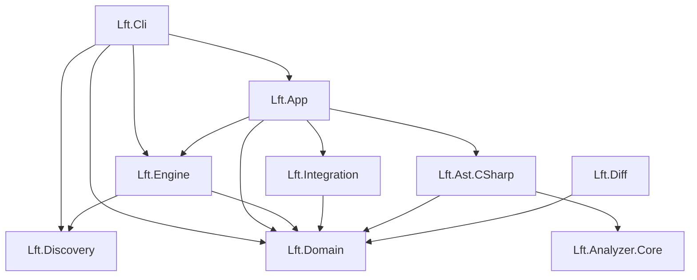

# 🏗️ Plan de Refactorización: Proyecto Lft

## 1. Mapa de Arquitectura Actual

La solución sigue una estructura de capas vertical, pero con un acoplamiento fuerte en el punto de entrada y mezcla de responsabilidades en la capa de Aplicación.

### Diagrama de Dependencias


### Responsabilidades por Módulo
* **`Lft.Cli`**: Punto de entrada. Actualmente **sobrecargado**: hace parsing de argumentos, configuración manual de DI (Dependency Injection) y orquestación inicial.
* **`Lft.App`**: Orquestador principal (`GenPipeline`). Mezcla lógica de negocio con **presentación** (escribe a `Console`).
* **`Lft.Engine`**: Motor de templates. Tiene una dependencia oculta hacia `DiscoveryService` que instancia manualmente.
* **`Lft.Domain`**: Modelos puros. Correctamente aislado.
* **`Lft.Integration`**: Lógica de modificación de archivos. Usa manipulación de strings primitiva (`StringBuilder`).
* **`Lft.Analyzer.Core`**: Definiciones abstractas de análisis.
* **`Lft.Ast.CSharp`**: Implementación concreta de Roslyn.
* **`Lft.Discovery`**: Inteligencia sobre el proyecto existente. `ProjectAnalyzer` es un poco monolítico.

---

## 2. Hotspots y Code Smells Detectados 🚨

Priorizados por impacto en mantenibilidad:

1. **`Lft.Cli/Program.cs` (God Class / Setup Bloat)**
   * **Problema**: 60+ líneas de "Manual DI" (líneas 87-146). Instancia cada servicio a mano (`new Service(...)`).
   * **Impacto**: Añadir una dependencia requiere cambiar `Program.cs` y reordenar constructores. Muy frágil.
   * **Violación**: Inversión de Control (IoC) manual y propensa a errores.

2. **`Lft.App/Pipelines/GenPipeline.cs` (Leaky Abstraction)**
   * **Problema**: Contiene lógica de presentación (`Console.WriteLine`) mezclada con lógica de orquestación. Maneja el "Dry Run" imprimiendo a consola directamente.
   * **Impacto**: No se puede reutilizar el pipeline en una GUI o test sin "ensuciar" la salida estándar.
   * **Violación**: Single Responsibility Principle (SRP).

3. **`Lft.Engine/TemplateCodeGenerationEngine.cs` (Hidden Coupling)**
   * **Problema**: Instancia `new DiscoveryService(...)` dentro de `GenerateAsync` (Línea 54).
   * **Impacto**: Imposible de mockear el descubrimiento en tests unitarios del motor.
   * **Violación**: Dependency Inversion Principle (DIP).

4. **`Lft.Integration/AnchorIntegrationService.cs` (Primitive Obsession)**
   * **Problema**: Usa `StringBuilder` y `Replace` para modificar código.
   * **Impacto**: Frágil ante variaciones de formato (espacios, tabs).
   * **Violación**: Falta de abstracción adecuada para manipulación de código.

5. **`Lft.Discovery/ProjectAnalyzer.cs` (Complexity)**
   * **Problema**: Clase de >300 líneas que mezcla escaneo de sistema de archivos, regex y lógica de negocio.
   * **Impacto**: Difícil de leer y testear casos borde.

---

## 3. Plan de Refactorización por Fases 🚀

### Fase 0: Higiene y Cimientos (Low Hanging Fruit)
*Objetivo: Preparar el terreno sin cambiar lógica compleja.*

* [ ] **Introducir DI Container**: Reemplazar la instanciación manual en `Program.cs` por `Microsoft.Extensions.DependencyInjection`.
  * Crear `ServiceCollectionExtensions` en cada proyecto (`Lft.App`, `Lft.Engine`, etc.) para registrar sus propios servicios (`AddLftApp()`, `AddLftEngine()`).
* [ ] **Estandarizar Logging**: Reemplazar `Console.WriteLine` dispersos por `Microsoft.Extensions.Logging.ILogger`.
* [ ] **Limpiar `Program.cs`**: Debería reducirse a: Configurar DI -> Parsear Args -> Ejecutar Comando.

### Fase 1: Decomponer Responsabilidades (Separation of Concerns)
*Objetivo: Que cada clase haga una sola cosa (Unix Philosophy).*

* [ ] **Separar Pipelines**:
  * `GenPipeline`: Orquesta generación. No imprime nada. Devuelve `PipelineResult`.
  * `AnalyzePipeline` (Futuro): Orquesta análisis usando `AnalyzerEngine`.
* [ ] **Refactorizar Clases Clave (Definition of Done)**:
  * `GenPipeline`: "Orquesta pasos, no imprime nada, no sabe de consola".
  * `TemplateCodeGenerationEngine`: "Sólo sabe ejecutar packs y steps; no hace discovery ad-hoc".
  * `ProjectAnalyzer`: "Sólo arma `ProjectManifest`; no hace regex locas, delega en helpers".
* [ ] **Desacoplar `Engine` de `Discovery`**:
  * Inyectar `IProjectAnalyzer` o `IDiscoveryService` en el constructor de `TemplateCodeGenerationEngine`.

### Fase 2: Reducir Código Duplicado y Robustez
*Objetivo: Eliminar "reinventar la rueda" y usar lo que ya existe.*

* [ ] **Mejorar Integración (Smart vs Dumb)**:
  * Migrar `AnchorIntegrationService` para usar `CSharpInjectionService` (Roslyn) cuando el target sea C#.
  * Dejar la integración por anchors solo para archivos de texto/configuración.
* [ ] **Conectar Discovery con Templates**:
  * Actualizar `_index.yml` para usar targets dinámicos (`target: ServiceRegistration`) en lugar de rutas hardcodeadas.
  * Reducir parámetros manuales en `lft gen` aprovechando la inteligencia de `Lft.Discovery`.

### Fase 3: Ergonomía y API Interna
*Objetivo: Preparar para el futuro (GUI, Plugins).*

* [ ] **Unificar Contexto**: Crear un `LftContext` que viaje por el pipeline.
* [ ] **Comandos como Unidades**:
  * `IGenCrudCommand` / `GenCrudCommandHandler`.
  * `IAnalyzeArchCommand` / `AnalyzeArchCommandHandler`.
* [ ] **Plugins**: Definir interfaz `ILftPlugin`.

---

## 4. Recomendaciones Específicas

### `Lft.Cli`
* **Acción**: Instalar `Microsoft.Extensions.DependencyInjection` y `Spectre.Console` (para UI bonita).
* **Nuevo `Program.cs`**:
  ```csharp
  var services = new ServiceCollection();
  services.AddLftCore(); // Registra App, Engine, Domain
  services.AddLftInfrastructure(); // Registra Ast, FileSystem
  var provider = services.BuildServiceProvider();
  await provider.GetRequiredService<CliRunner>().RunAsync(args);
  ```

### `Lft.App`
* **Acción**: Eliminar `Console.WriteLine`.
* **Nuevo `GenPipeline`**:
  ```csharp
  // Firma limpia: recibe request, devuelve resultado. Nada de UI.
  public async Task<PipelineResult> ExecuteAsync(GenerationRequest request);
  ```

### `Lft.Integration`
* **Acción**: Crear estrategias tipadas.
* **Nueva Estructura**:
  * `Strategies/AnchorInsertionStrategy.cs`
  * `Strategies/RegexReplacementStrategy.cs`
  * `Strategies/RoslynInjectionStrategy.cs` (Adaptador hacia `Lft.Ast.CSharp`)

---

## 5. Checklist de Aceptación ✅

* [ ] **`Program.cs` < 50 líneas**: Sin `new Class(...)` anidados.
* [ ] **Cero `Console.WriteLine` en `Lft.App` y `Lft.Engine`**: Todo output viaja por `ILogger` o objetos de retorno.
* [ ] **Tests Verdes**: `Lft.Analyzer.Tests` y `Lft.Ast.CSharp.Tests` pasan sin cambios.
* [ ] **Inyección de Dependencias**: Todos los servicios principales se resuelven por constructor.
* [ ] **Comportamiento Idéntico**: Ejecutar `lft gen crud User` genera exactamente los mismos bytes que antes.
